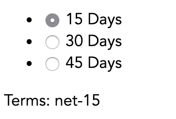
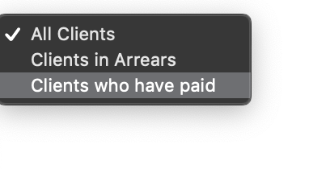

# Using Form Controls

## Using `v-model`

1. Using a `v-model` can often simplify your event handling code. Replace the `@input` handler with a `v-model`. What should its value be? Check that it works.


## Using `v-model` with a List of Checkboxes

1. A new requirement is to have a way to delete clients by selecting their names. To do this:

    1. Add an `<input type="checkbox">` next to the client's name.
    2. Use `v-model` to bind this checkbox's value to `client.isSelected`.
    3. Add a "Delete Selected" `<button>` somewhere on the page.
    4. Add an event handler to this button that deletes the selected clients. To do this, use the array [filter](https://developer.mozilla.org/en-US/docs/Web/JavaScript/Reference/Global_Objects/Array/filter) function.


## Implementing a set of Radio Buttons

Create a set of radio buttons that enables the user to choose which payment terms to apply:



To do this:

1. Create an `<input type="radio" name="terms" id="net-XX" value="net-XX">` for each value, where XX is the payment term in days.

2. Add a `<label for="net-XX">XX days</label>` after each `<input>`.

3. Add a `selectedTerm` field to your data object, initializing it to `"net-30"`.

4. Bind each Radio Button to this data field using `v-model`.

5. Display the selected terms below the radio button group.


## Building the Radio Buttons Dynamically

The terms are now available as an object:

```
{
"net-15": "15 Days",
"net-30": "30 Days",
"net-45": "45 Days",
"net-60": "60 Days"
}
```

Find a way to generate the list of radio buttons dynamically from this data.


## Using `v-model` with a Select Menu

1. Another requirement is that we can filter clients by their credit status:

    

    1. Create a `<select>` menu containing `<option>` elements.
    2. Give each `<option>` a `value` (eg `"all"`) and some descriptive text for its contents.
    3. Use a `v-model` to bind the selected `value` to a `clientFilter` property on your `data` object.
    4. Change the `v-for` from:

           <li v-for="client in clients">
       
       to

           <li v-for="client in filteredClients()">

    5. Write a `filteredClients()` method which, depending on the `clientFilter`, returns the correct list of clients.